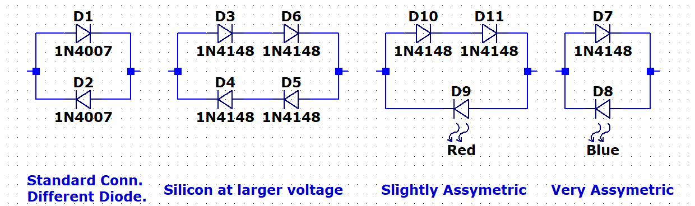
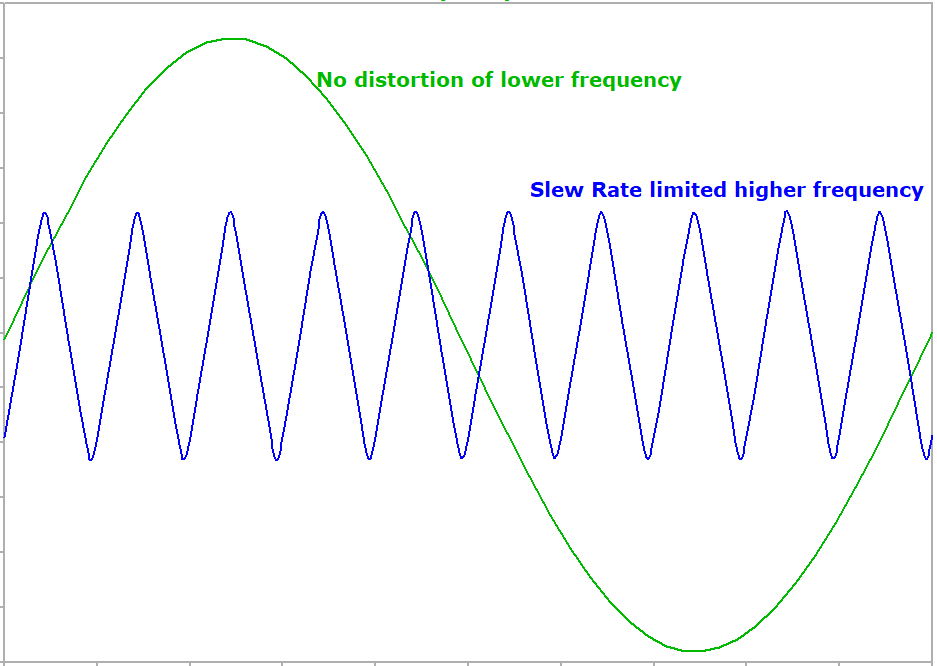

# Modification Ideas

## Diode Swapping

The most basic, and probably most useful modification would be to swap out the clipping diodes (D3 & D4 or D5 & D6) for another type. Consider installing a socket for at least one of the clipping combinations for easy swapping.

Some ideas:

Stack 2 1n4148 diodes in series instead of the single that are in there now. This should make the volume difference between the silicon and LED clip selection close to equal.

Different types of silicon diodes may have subtly different characteristic. Try a big power diode like a 1n4007 in place of the 1n4148. While all silicon diodes should clip at the same voltage, the parasitic properties like on resistance and junction capacitance might change the sound.

You can put different diodes for each direction to make an assymetrical clip characteristic. Try a silicon diode one way and an led the other. Different colors of LED's should clip at slightly different voltages for a subtle asymmetry.

Germanium will clip at an even lower voltage than silicon, and this will come through a very compressed character. It will also be pretty quiet relative to other semiconductors.

Tons of possibilities here, Schottky diodes, zener diodes (forward or backwards biased), diode connected mosfets, or remove the diodes entirely and let the op amp clip itself for maximum volume.

## Filter Changes
C4 sets the low frequency cutoff according to 1/(2 * pi * 1800 * C)
The stock setting puts the rolloff at 400 Hz. If you feel it is lacking in the low end, try swapping this cap for the next size up. Or several sizes up. It's pretty hard to predict the frequency cutoff that will sound good, so just experiment.

## Additional Op amp Section
The NJM4580D is a dual op amp, and we are only using one of the sections. You could replace the JFET buffer with an op amp buffer for a little different sound OR:

* Configure it as a summing amp, and use it to blend in the dry signal with the dirty signal. This could be especially useful for bass.

* Build a second stage of clipping, cascaded after the first for very thick distortion. maybe build a second stage that uses diode to ground style clipping (as opposed to diodes in the feedback loop the existing stage uses) Use a switch to give either side or both together.

* Build an active low pass filter for tighter control over the high end.

## Swap the op amp.

The NJM4580D was chosen to go into slew rate distortion at the extreme settings. This technique is also used in the Rat distortion. Use a faster op amp like the NE5532 to avoid slew rate distortion. This is probably a pretty subtle change, but since the op amp is socketed, it is easy to try.

Slew rate is the maximum rate of change of an op amp usually expressed in V/us. The NJM4580D has a slew rate of 5 V/us while the NE5532 is 9 V/us. We can determine the frequency where slew rate limiting occurs by looking at the following:
* Maximum input level, A = 200 mV
* Maximum rate of change of sinusoid max(dV/dt) = max(d/dt(Asin(2 * pi * f * t)) = 2 * pi * f * A
* Maximum Gain of circuit (ignoring diodes, because max(dV/dt) occurs at the zero crossing.): G = 1 + (1Mohm +10kohm)/(1.8kohm) = 562

Combining these equations gives the maximum frequency without slew rate limiting.

SR = 2 * pi * f * A * G
f = SR / (2 * pi * A * G)
  = 5 x 10^6 V/s / (2 * pi * 0.2 V * 562)
  = 7 kHz.

We could recalculate and find, for instance, the gain where slew rate limiting occurs at 20kHz, or the input signal level that cause slew rate limiting at a particular frequency.

