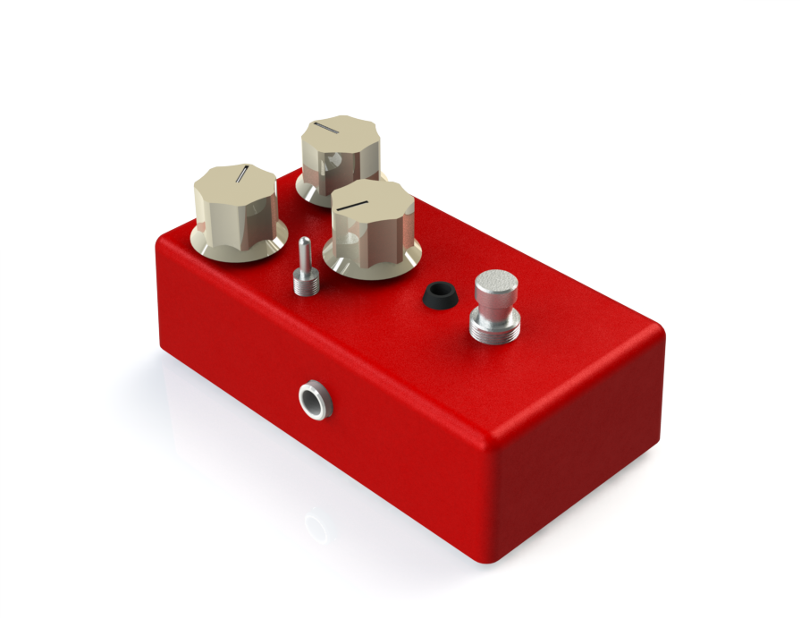

# Firemace

The Firemace is a distortion pedal based on [Robin Tomtlunds Red Fuzz](http://www.generalguitargadgets.com/effects-projects/distortion/red-fuzz/) design.

Check out the [schematic](firemace-schematic.pdf), the potential [modifications](modifications/), or view the PCB [front](firemace-pcb-front.png) and [back](firemace-pcb-back.png). You can also get the [bill of material](firemace-BOM.xlsx)

